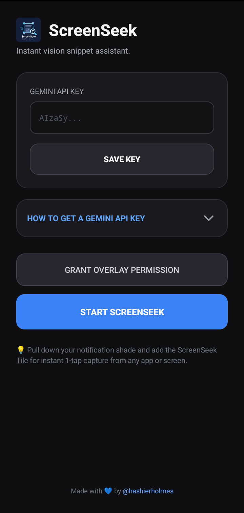
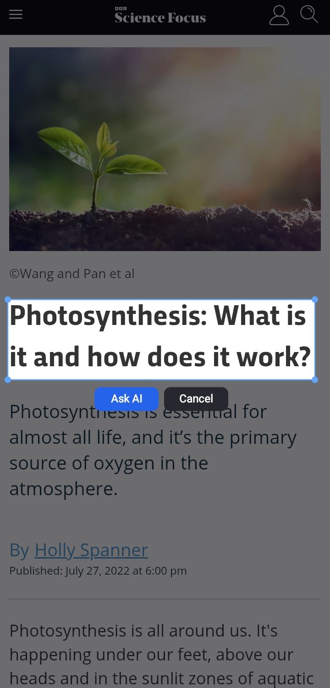
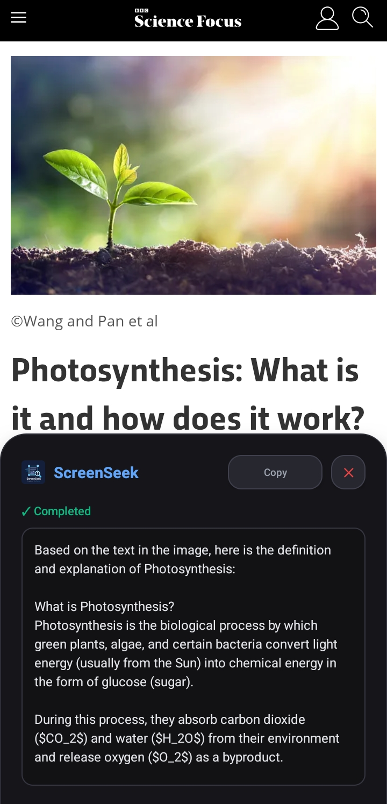

# ScreenSeek

**Instant vision snippet assistant for Android.**  
*Snap any part of your screen like Windows Snipping Tool and query Google Gemini in real time.*

[](LICENSE)
[](https://android.com)
[]()
[]()
[]()

<p align="center">
  <a href="https://github.com/hashierholmes/ScreenSeek/releases/latest">
    
  </a>
</p>
---

## Overview

**ScreenSeek** is a lightweight, dependency-free screen analysis tool for Android. It allows users to select and crop any area of their screen using an interactive snipping overlay without switching away from the current application.

The selected visual snippet is sent directly to the **Google Gemini Vision API**, with the generated response displayed through a clean floating card.

ScreenSeek does not require a separate backend or middleware server. API requests are sent directly from the device to Google using the user's own Gemini API key.

---

## Screenshots

<p align="center">
  
  &nbsp;&nbsp;
  
  &nbsp;&nbsp;
  
</p>

---

## Features

- **Screen Region Selection** — Select arbitrary rectangular regions of the current display through an interactive overlay.
- **Quick Settings Integration** — Launch the screen selection workflow directly from the Android Quick Settings panel.
- **Direct Gemini API Integration** — Communicates directly with Google's Gemini API without third-party middleware.
- **Bring Your Own API Key** — Users provide and manage their own Gemini API credentials locally within the application.
- **Native Android Implementation** — Built using the Android SDK and Java without AndroidX or external UI frameworks.
- **Response Formatting** — Processes Gemini responses and converts basic Markdown formatting into readable application output.
- **Progressive Processing States** — Provides visual feedback throughout capture, upload, and analysis operations.
- **Clipboard Integration** — Allows generated responses to be copied directly to the system clipboard.
- **Native Overlay Interface**
Uses Android's `WindowManager` for the screen selection interface and floating result view.
- **Minimal Dependency Footprint**— The project avoids unnecessary third-party dependencies and relies primarily on Android framework APIs.
---

## Architecture

```text
[ Quick Settings Tile / In-App Launch ]
                  │
                  ▼
      [ CapturePromptActivity ]
                  │
       MediaProjection Request
                  │
                  ▼
       [ ScreenCaptureService ]
                  │
          Foreground Service
                  │
                  ▼
         [ SnipOverlayView ]
                  │
       Interactive Region Crop
                  │
                  ▼
        [ GeminiApiHelper ]
                  │
      Base64 JPEG HTTP Payload
                  │
                  ▼
           [ Gemini API ]
                  │
          Analysis Response
                  │
                  ▼
        [ Floating Answer Card ]
```

---

## Components

| Component | Responsibility |
| :--- | :--- |
| `MainActivity` | Application settings, API key configuration, and permission setup. |
| `CapturePromptActivity` | Handles the `MediaProjection` authorization flow before screen capture begins. |
| `ScreenCaptureService` | Manages screen capture, foreground service execution, and the floating result interface. |
| `ScreenSeekTileService` | Provides ScreenSeek integration with Android Quick Settings. |
| `SnipOverlayView` | Provides the interactive screen selection and cropping interface. |
| `GeminiApiHelper` | Handles direct REST communication with the Gemini API. |
| `TextFormatter` | Processes Markdown and sanitizes response formatting. |

---

## Project Structure

```text
app/src/main/
├── AndroidManifest.xml
├── java/
│   └── hh/screenseek/app/
│       ├── MainActivity.java           # Settings dashboard & permission setup
│       ├── CapturePromptActivity.java  # Projection authorization handler
│       ├── ScreenCaptureService.java   # Capture engine & floating result UI
│       ├── ScreenSeekTileService.java  # Quick Settings Tile service
│       ├── SnipOverlayView.java        # Interactive screen selection canvas
│       ├── GeminiApiHelper.java        # Direct REST client for Gemini API
│       └── TextFormatter.java          # Markdown and text formatting
└── res/
    ├── drawable/
    │   ├── bg_card.xml
    │   ├── bg_input.xml
    │   ├── bg_btn_primary.xml
    │   ├── bg_btn_secondary.xml
    │   ├── bg_dialog.xml
    │   ├── ic_logo.xml
    │   └── icon.xml
    └── layout/
        ├── activity_main.xml
        └── layout_result_dialog.xml
```

---

## Android APIs

ScreenSeek primarily relies on native Android framework APIs:

- `MediaProjection` — screen capture authorization and projection management.
- `ImageReader` — receives captured display frames.
- `WindowManager` — renders the selection overlay and floating result interface.
- `Service` — maintains the screen capture workflow outside the main activity.
- `TileService` — integrates ScreenSeek with Android Quick Settings.
- `HttpURLConnection` — communicates with the Gemini REST API.
- `Bitmap` — handles image cropping and encoding.
- `ClipboardManager` — provides response copy functionality.

---

## Permissions

| Permission | Purpose |
| :--- | :--- |
| `android.permission.INTERNET` | Communicates directly with the Google Gemini API. |
| `android.permission.SYSTEM_ALERT_WINDOW` | Renders the snipping overlay and floating answer card over other applications. |
| `android.permission.FOREGROUND_SERVICE` | Keeps the capture process running through a foreground service. |
| `android.permission.FOREGROUND_SERVICE_MEDIA_PROJECTION` | Required for foreground services using MediaProjection on supported Android versions. |

Screen capture itself also requires explicit runtime authorization through the Android `MediaProjection` consent flow.

---

## Requirements

- Android device running **Android 5.0 (API 21)** or higher.
- Android SDK and Gradle.
- [Android Studio](https://developer.android.com/studio) or [AndroidIDE](https://androidide.com/) (Mobile IDE).
- A Google Gemini API key from [Google AI Studio](https://aistudio.google.com/app/apikey).

---

## Build

Clone the repository:

```bash
git clone https://github.com/hashierholmes/ScreenSeek.git
cd ScreenSeek
```

Open the project in Android Studio or AndroidIDE.

Build the debug APK:

```bash
./gradlew assembleDebug
```

The generated APK will be located at:

```text
app/build/outputs/apk/debug/app-debug.apk
```

Install it using ADB:

```bash
adb install app/build/outputs/apk/debug/app-debug.apk
```

---

## Release Signing

ScreenSeek uses a local `keystore.properties` file to keep release signing configuration separate from the Gradle build scripts.

Create `keystore.properties` in the project root:

```properties
STORE_FILE=path/to/your/keystore.jks
STORE_PASSWORD=your_store_password
KEY_ALIAS=your_key_alias
KEY_PASSWORD=your_store_password
```

The file should remain local and must not be committed to version control.

Add the following to `.gitignore`:

```gitignore
keystore.properties
*.jks
*.keystore
```

Release signing credentials should remain outside the source tree and should never be committed to the repository.

---

## Configuration & Usage

### Configuration

1. Launch **ScreenSeek**.
2. Enter your **Google Gemini API Key**.
3. Save the API key.
4. Grant **Display over other apps** permission.
5. Grant screen capture permission when requested.

### Quick Settings Setup

Add the ScreenSeek tile to Android Quick Settings:

1. Open the Quick Settings panel.
2. Tap the **Edit** button.
3. Add **ScreenSeek** to the active tiles.

### Using ScreenSeek

1. Activate ScreenSeek from the Quick Settings tile or application.
2. Drag across the screen to select the content you want to analyze.
3. Confirm the selected region.
4. ScreenSeek crops the selected area from the captured frame.
5. The image is sent directly to Gemini for analysis.
6. The generated response is displayed through the floating result card.
7. Use the clipboard action to copy the response when needed.

---

## Development & Feedback

ScreenSeek is primarily maintained by its author.

The project does not currently accept direct code contributions or pull requests. This allows the project to maintain a consistent architecture, design direction, and minimal dependency philosophy.

Bug reports, suggestions, and feature requests are still welcome through the repository's issue tracker. Feedback may be reviewed and incorporated at the author's discretion.

Please avoid submitting pull requests unless specifically requested.

---

## Note

> **Note:** This project follows a strict **No-AndroidX / Pure Native Android SDK** principle to keep the codebase minimal, bloat-free, and easily buildable without heavy dependencies.

---

## License

ScreenSeek is distributed under the **MIT License**.

See [`LICENSE`](LICENSE) for more information.
